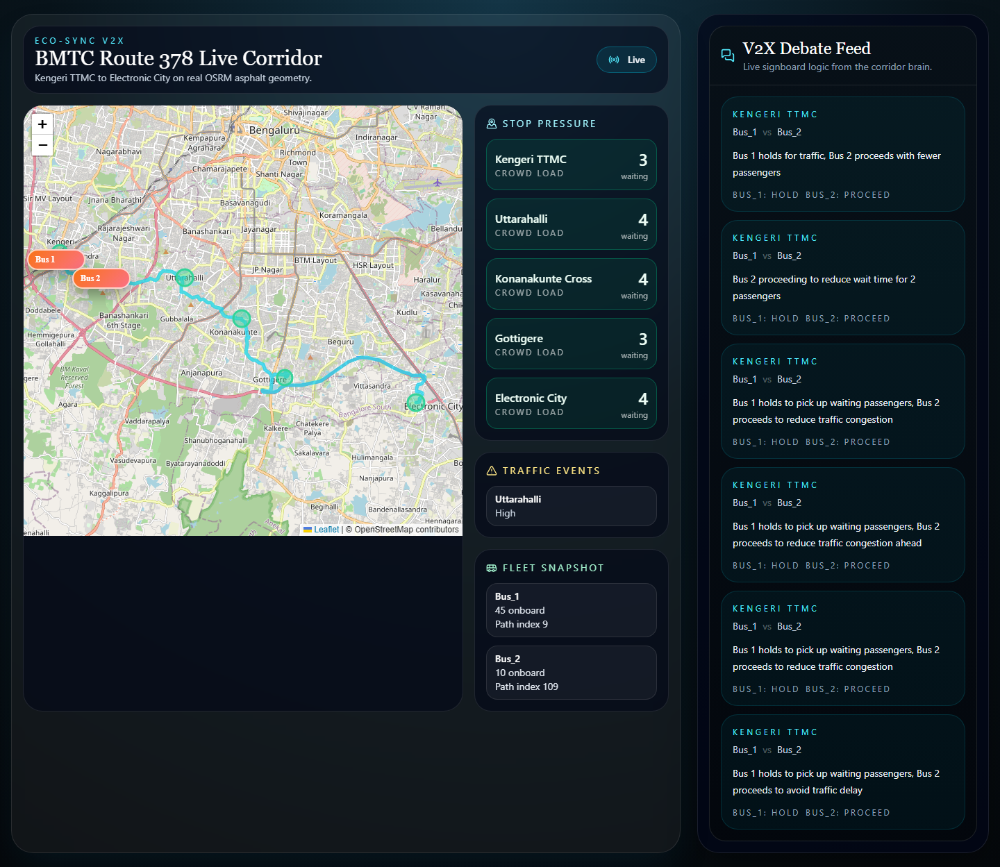
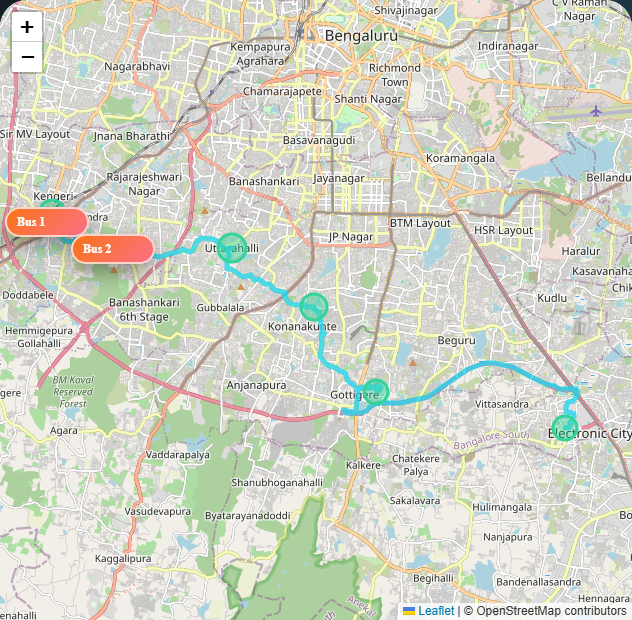

# ECO-SYNC V2X (Intelligent Transport System)

## Overview

ECO-SYNC V2X is a multi-agent intelligent transport simulation built around Bengaluru's BMTC Route 378, connecting Kengeri TTMC to Electronic City. The system demonstrates how real-time vehicle-to-everything coordination can reduce bus bunching, react to corridor congestion, and improve transit efficiency using geographically accurate routing, live state streaming, and LLM-powered operational reasoning.

This project models the South Bengaluru corridor using real road geometry from OSRM, simulates passenger accumulation and traffic events, and allows two buses to coordinate maneuvers such as holding, proceeding, or skipping based on immediate operational economics.

## Tech Stack

- FastAPI
- React
- Leaflet
- OSRM API
- Groq (`llama-3.3-70b-versatile`)

## Visual Documentation

### Hero Shot



### Physical Infrastructure



## The V2X Brain

The corridor brain uses Groq-hosted Llama 3.3 70B to evaluate live economic trade-offs between passenger wait time, traffic delay, and onboard load. The decision is not hardcoded. Instead, the model adapts to live state and returns strict parseable JSON that the backend streams directly into the feed.

Example captured reasoning:

```json
{
  "stop": "Kengeri TTMC",
  "bus_1_id": "Bus_1",
  "bus_2_id": "Bus_2",
  "decision": {
    "bus_1_action": "HOLD",
    "bus_2_action": "PROCEED",
    "reasoning_for_signboard": "Bus 1 holds to pick up waiting passengers, Bus 2 proceeds to avoid traffic delay"
  }
}
```

That live result highlights the core design goal: the agents debate and adapt in real time instead of replaying a fixed script, balancing service coverage against corridor flow.

## Under the Hood

The backend runs an asynchronous WebSocket loop that streams simulator state at a stable 1 tick per second. Every payload contains live bus coordinates, stop crowd pressure, traffic events, and the latest V2X debate result, keeping the React frontend and FastAPI backend synchronized throughout the demonstration.

## Installation

### Backend

1. Create and activate a Python environment.
2. Install dependencies:

```bash
pip install -r requirements.txt
```

3. Create a `.env` file in the project root:

```bash
GROQ_API_KEY=your_groq_api_key_here
```

4. Start the backend server:

```bash
uvicorn backend.main:app --reload --port 8000
```

### Frontend

1. Move into the frontend app:

```bash
cd frontend
```

2. Install dependencies:

```bash
npm install
```

3. Start the Vite development server:

```bash
npm run dev
```

### Live Demo

With both services running, open the frontend in the browser and watch Route 378 update in real time as buses move along the OSRM-derived road geometry, stop pressure builds, and the V2X feed renders live AI reasoning decisions.
